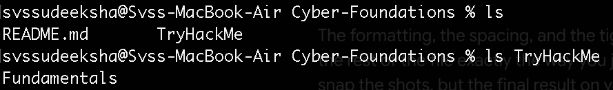
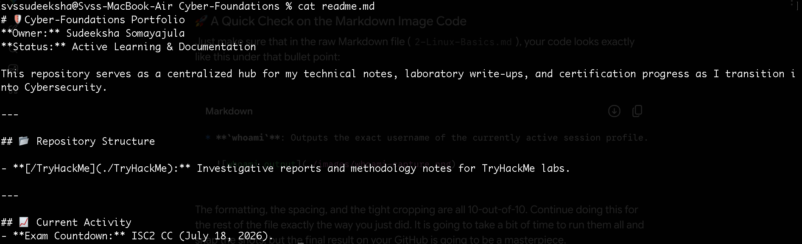
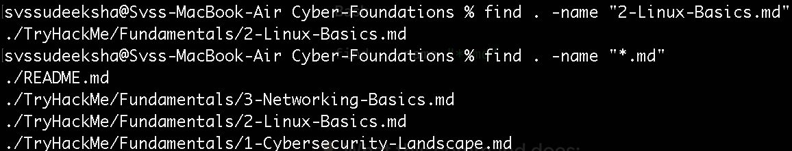
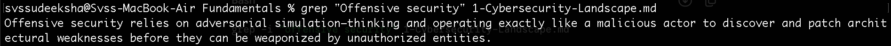
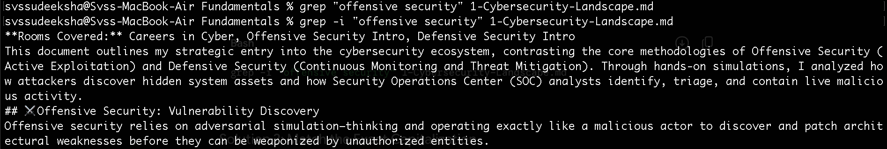
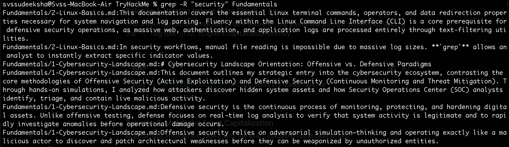
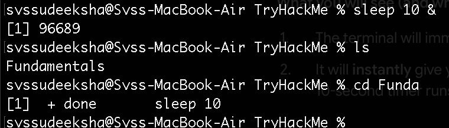
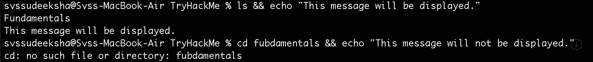
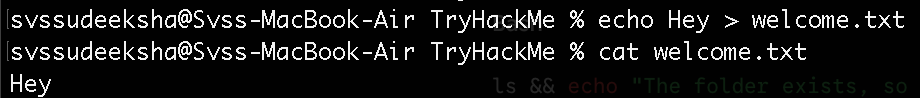
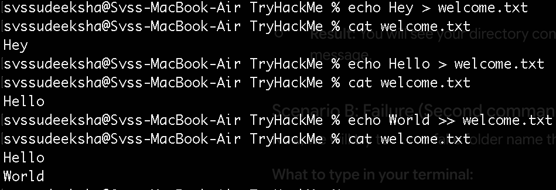

# Linux System Administration & Text Parsing Fundamentals

**Date Completed:** June 9, 2026  
**Category:** Operating Systems  
**Rooms Covered:** Linux Fundamentals 1

---

## Executive Summary

This documentation covers the essential Linux terminal commands, operators, and data redirection properties necessary for system navigation and log parsing. Fluency within the Linux Command Line Interface (CLI) is a core prerequisite for defensive security operations, as massive web, authentication, and application logs are processed entirely through text-filtering utilities.

---

## System Navigation & Information Gathering

- **`whoami`**: Outputs the exact username of the currently active session profile.
  

- **`pwd`** (_Print Working Directory_): Returns the absolute directory path of the current terminal context.
  

- **`ls`** (_Listing_): Lists the contents of the current directory.
  - `ls [folder_name]`: Targets and lists the contents of a specific subdirectory without changing the current path context.
    

- **`cd`** (_Change Directory_): Modifies the current working terminal directory to a specified path.
  

---

## 📁 File Manipulation, Management, & Searching

- **`echo`**: Outputs a specified string of text directly to the standard output stream.
  

- **`cat`**: Concatenates and outputs the complete underlying content of a file (handles binary structures, configurations, and data scripts—not just plain text files).
  

- **`find`**: Searches the file system for files across directory boundaries.
  - Finding by Name: `find . -name "filename"`
  - Finding by Extension (using wildcards): `find . -name "*.txt"` _(locates all files matching the target extension)_
    

---

## Deep-Dive: Advanced Filtering with `grep`

In security workflows, manual file reading is impossible due to massive log sizes. **`grep`** allows an analyst to instantly extract specific indicator values.

- **Standard Search:** Extracts lines matching a target string from a single localized file.
  - Syntax: `grep "search_key" filename`
    
  - Note on Case-Sensitivity: By default, `grep` is strictly case-sensitive. The `-i` flag is appended to ignore case boundaries entirely during execution.
    

- **Recursive Search (`-R`)**: Searches for a target string across multiple subfolders and files simultaneously. This is used daily in incident response to find a malicious IP address hidden deep inside nested web server logs.
  - Syntax: `grep -R "search_key" /total/directory/name`
    

---

## Special Operators & Data Redirection

Special operators and redirectors allow an analyst to manipulate process tracking, execution states, and terminal output streams.

### 1. Background Execution (`&`)

Placing a single ampersand at the end of an execution string pushes the process to run in the background. This allows the analyst to maintain active CLI usage without waiting for long-running scripts or network monitors to terminate.

- **Syntax:** `command &`
  

### 2. Conditional Execution Chain (`&&`)

Combines multiple terminal commands into a single execution line.

- **Syntax:** `Command1 && Command2`
- **Core Principle:** `Command2` will execute **only** if `Command1` terminates successfully (exits with a clean return code of 0).
  

### 3. Standard Output Redirector (`>`)

Takes the data payload generated by a command-line utility and writes it directly to a file.

- **Behavior:** If the target file already exists, its previous content is entirely overwritten and deleted.
- **Operational Use-Case:** Saving a fresh network configuration snapshot or wiping out old report data.
  

### 4. Append Output Redirector (`>>`)

Takes the data payload generated by a command-line utility and appends it cleanly to the very bottom of the target file on a new line.

- **Behavior:** Adds the new data safely without modifying or deleting any of the existing content.
- **Operational Use-Case:** Generating a running timeline log of analyst triage steps during an active incident investigation.
  
